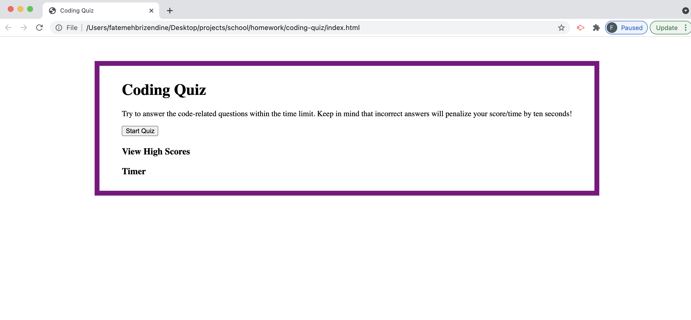

# Code Quiz

## Description
This is a timed coding assessment, and includes multiple-choice questions. 

## Systems
This application was created using HTML, CSS, and JavaScript with Visual Studio Code.

## Application
The user is taken to a code quiz, and clicks on the start button. When they click on the start button, they are presented wiht a question and the timer starts counting down from 75 seconds. When they answer the question, they are taken to the next question until they reach the last one. Then they are presented with a results page where they can enter their initials and save their score.

## Webpage

The following image shows a screenshot of the application: 

You can access the GitHub repository here:

You can access the webpage here: 